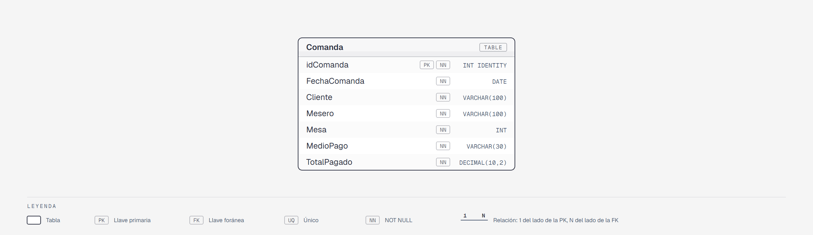

# Datos de práctica — Evidencia 3 · RestauranteDB

Este documento describe el orden de ejecución de los scripts SQL para instalar la base de datos de práctica de la Evidencia 3.

---

## Contexto

**RestauranteDB** representa el registro de comandas (tickets) de un restaurante a lo largo del año 2025. Los datos provienen de una hoja de cálculo plana: cada fila es una comanda con los datos del cliente, el mesero que atendió, la mesa asignada, el medio de pago y el total cobrado.

La tabla **no está normalizada** — los campos `Cliente`, `Mesero` y `MedioPago` son texto libre. En una base de datos normalizada, cada uno de estos campos sería una llave foránea a su propio catálogo.

---

## Estructura de la tabla



Versión navegable del diagrama: [`assets/diagrama-er.html`](assets/diagrama-er.html). Ficha completa de la tabla en el diccionario de datos: [`docs/tablas/Comanda.md`](docs/tablas/Comanda.md).

| Columna | Tipo | Descripción |
|---------|------|-------------|
| `idComanda` | `INT IDENTITY PK` | Identificador único de la comanda |
| `FechaComanda` | `DATE` | Fecha en que se registró la comanda |
| `Cliente` | `VARCHAR(100)` | Nombre completo del cliente |
| `Mesero` | `VARCHAR(100)` | Nombre completo del mesero que atendió |
| `Mesa` | `INT` | Número de mesa (1–15) |
| `MedioPago` | `VARCHAR(30)` | Forma de pago utilizada |
| `TotalPagado` | `DECIMAL(10,2)` | Monto total de la comanda |

---

## Prerequisito

Cada script (excepto el primero, que crea la base de datos) empieza con `USE RestauranteDB;`, así que se ejecuta sobre RestauranteDB aunque tengas seleccionada otra base en el dropdown de SSMS.

---

## Instalación

Dos opciones:

- **Rápida:** abrir [`instalar-completo.sql`](instalar-completo.sql) en SSMS y ejecutarlo completo (F5). Crea la base de datos, la tabla y las 300 comandas en un solo paso.
- **Paso a paso:** ejecutar los scripts de [`instalacion`](instalacion) en el orden de abajo.

`instalar-completo.sql` se genera concatenando los archivos de `instalacion/` en orden alfabético; si se modifica algún script de `instalacion/`, hay que regenerarlo.

### Paso 1 — Crear la base de datos

Ejecuta este script **una sola vez**. Si RestauranteDB ya existe, omítelo.

```
instalacion/01-create-database.sql
```

> Después de ejecutarlo, selecciona **RestauranteDB** en el dropdown de SSMS.

---

### Paso 2 — Crear la tabla

```
instalacion/02-create-table-comanda.sql
```

---

### Paso 3 — Insertar los datos de práctica

```
instalacion/03-insert-comanda.sql
```

Inserta **300 comandas** distribuidas a lo largo del año 2025, con 25 registros por mes.

---

## Resumen de datos en RestauranteDB

| Tabla | Registros | Descripción |
|-------|-----------|-------------|
| `Comanda` | 300 | Tickets del restaurante, todo el año 2025 |

| Dato | Valores posibles |
|------|-----------------|
| Clientes distintos | 30 |
| Meseros distintos | 8 (Tomás Castillo, Renata Espinoza, Rodrigo Moreno, Paulina Ibarra, Oscar Peña, Alicia Soto, Marco Cervantes, Isabella Sandoval) |
| Mesas | 1 – 15 |
| Medios de pago | Efectivo, Tarjeta de Credito (así, sin acento), Tarjeta de Débito, Transferencia |
| Rango de totales | $145.00 – $890.00 |

---

## Reversa

Para deshacer todo lo instalado, ejecuta los siguientes scripts **en el orden indicado**.

> Asegúrate de tener seleccionada la base de datos **RestauranteDB** en el dropdown de SSMS antes de ejecutar el paso R1.

### Paso R1 — Eliminar la tabla

```
reversa/01-drop-tables.sql
```

### Paso R2 — Eliminar la base de datos

> **Antes de ejecutar este script**, selecciona otra base de datos en el dropdown (por ejemplo: `master`). No puedes eliminar una base de datos a la que estás conectado.

```
reversa/02-drop-database.sql
```
