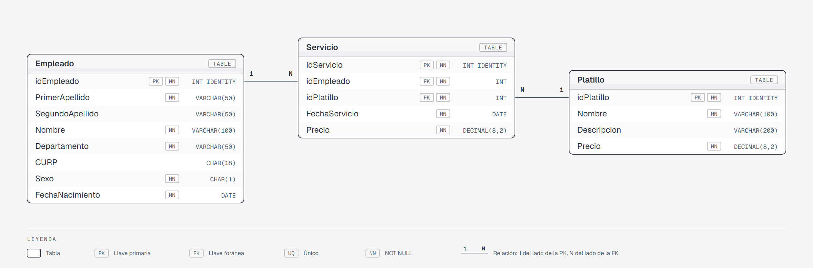

# 2da Oportunidad de Base de Datos I

**Grupo / Turno:** 434

---

## Contexto

**ComedorDB** modela el sistema de comedor subsidiado de una empresa. Los empleados pueden consumir un platillo por día; el precio se registra en el momento del servicio y puede diferir del precio vigente en el catálogo.

## Modelo de datos



Versión navegable del diagrama: [`assets/diagrama-er.html`](assets/diagrama-er.html).

3 tablas — cada una con su ficha de diccionario de datos en [`ComedorDB/docs/tablas`](ComedorDB/docs/tablas):

| Tabla | Descripción | Registros |
|-------|-------------|-----------|
| [`Empleado`](ComedorDB/docs/tablas/Empleado.md) | Catálogo de empleados por departamento | 25 |
| [`Platillo`](ComedorDB/docs/tablas/Platillo.md) | Catálogo de platillos con precio vigente | 10 |
| [`Servicio`](ComedorDB/docs/tablas/Servicio.md) | Hechos: consumo de un platillo por un empleado en una fecha | 54 |

### Departamentos representados

Producción, Administración, Recursos Humanos, Finanzas, Mantenimiento, Logística, Calidad, Ventas.

### Platillos disponibles

| idPlatillo | Nombre | Precio vigente |
|------------|--------|----------------|
| 1 | Pozole rojo | $45.00 |
| 2 | Enchiladas verdes | $40.00 |
| 3 | Tacos de bistec | $38.00 |
| 4 | Arroz con pollo | $42.00 |
| 5 | Milanesa de res | $48.00 |
| 6 | Sopa de lima | $35.00 |
| 7 | Tamales de rajas | $30.00 |
| 8 | Quesadillas de queso | $32.00 |
| 9 | Chile relleno | $44.00 |
| 10 | Frijoles charros | $28.00 |

### Datos para practicar

- Los empleados 23, 24 y 25 no tienen ningún servicio registrado (útil para `LEFT JOIN`).
- 19 de los 54 servicios tienen un precio cobrado distinto del precio vigente del platillo: algunos platillos costaron distinto en abril que en mayo de 2026.

## Constraints agregados

- `PRIMARY KEY` con `IDENTITY(1,1)` en todas las tablas.
- `FOREIGN KEY` nombradas (`fk_<Tabla>_<TablaReferenciada>`) en `Servicio`.
- `CHECK` en `Empleado.Sexo` (`IN ('M', 'F')`), y en `Platillo.Precio` y `Servicio.Precio` (`> 0`).

## Limitaciones conocidas del modelo

- **Un platillo por día:** es una regla del negocio, pero el modelo no la impide (no hay un `UNIQUE (idEmpleado, FechaServicio)`). Los datos iniciales sí la cumplen.

## Instalación

Cada script (excepto el primero, que crea la base de datos) empieza con `USE ComedorDB;`, así que se ejecuta sobre ComedorDB aunque tengas seleccionada otra base en el dropdown de SSMS.

Dos opciones:

- **Rápida:** abrir [`ComedorDB/instalar-completo.sql`](ComedorDB/instalar-completo.sql) en SSMS y ejecutarlo completo (F5). Crea la base de datos, las 3 tablas y los datos iniciales en un solo paso.
- **Paso a paso:** ejecutar los scripts de [`ComedorDB/instalacion`](ComedorDB/instalacion) en este orden:

| # | Archivo | Descripción |
|---|---------|-------------|
| 1 | `instalacion/01-create-database.sql` | Crea la base de datos `ComedorDB` |
| 2 | `instalacion/02-create-table-empleado.sql` | Tabla `Empleado` |
| 3 | `instalacion/03-create-table-platillo.sql` | Tabla `Platillo` |
| 4 | `instalacion/04-create-table-servicio.sql` | Tabla `Servicio` (FK → Empleado, Platillo) |
| 5 | `instalacion/05-insert-empleado.sql` | 25 empleados en 8 departamentos |
| 6 | `instalacion/06-insert-platillo.sql` | 10 platillos con precio vigente |
| 7 | `instalacion/07-insert-servicio.sql` | 54 servicios de abril y mayo de 2026 (empleados 1–22) |

`instalar-completo.sql` se genera concatenando los archivos de `instalacion/` en orden alfabético; si se modifica algún script de `instalacion/`, hay que regenerarlo.

## Reversa

### Paso R1 — Eliminar las tablas

| Orden | Tabla | Motivo |
|-------|-------|--------|
| 1° | `Servicio` | Depende de `Empleado` y de `Platillo`; debe ir primero |
| 2° | `Platillo` | Sin dependientes tras eliminar `Servicio` |
| 3° | `Empleado` | Sin dependientes tras eliminar `Servicio` |

```
ComedorDB/reversa/01-drop-tables.sql
```

### Paso R2 — Eliminar la base de datos

> **Antes de ejecutar este script**, selecciona otra base de datos en el dropdown (por ejemplo: `master`). No puedes eliminar una base de datos a la que estás conectado.

```
ComedorDB/reversa/02-drop-database.sql
```
