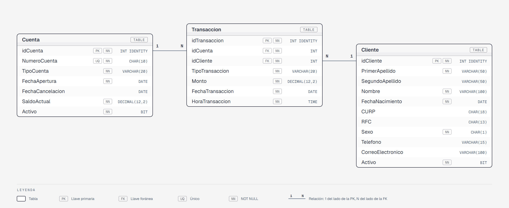

# Paquete de instalación — Examen Final · BancoDB

---

## Contexto

**BancoDB** es la base de datos de un banco que registra a sus clientes, las cuentas
que operan y los movimientos financieros realizados sobre ellas.

El banco ofrece tres tipos de cuenta: Débito, Nómina y Ahorro. Una cuenta puede
cancelarse en cualquier momento; cuando eso ocurre se registra la fecha de cancelación
y se marca como inactiva, pero el registro se conserva por historial.

Cada movimiento financiero se denomina **transacción**. Una transacción queda vinculada
a la cuenta que fue afectada y al cliente que la realizó. Los tipos de transacción
disponibles son: Depósito, Retiro y Transferencia.

---

## Modelo relacional

```
Table Cliente {
  idCliente        int          [pk, increment]
  PrimerApellido   varchar(50)  [not null]
  SegundoApellido  varchar(50)
  Nombre           varchar(100) [not null]
  FechaNacimiento  date         [not null]
  CURP             char(18)
  RFC              char(13)
  Sexo             char(1)      [not null]   -- 'M' o 'F'
  Telefono         varchar(15)
  CorreoElectronico varchar(100)
  Activo           bit          [not null, default: 1]
}

Table Cuenta {
  idCuenta          int           [pk, increment]
  NumeroCuenta      char(10)      [not null, unique]
  TipoCuenta        varchar(20)   [not null]   -- 'Débito', 'Nómina', 'Ahorro'
  FechaApertura     date          [not null]
  FechaCancelacion  date
  SaldoActual       decimal(12,2) [not null, default: 0]
  Activo            bit           [not null, default: 1]
}

Table Transaccion {
  idTransaccion    int           [pk, increment]
  idCuenta         int           [ref: > Cuenta.idCuenta]
  idCliente        int           [ref: > Cliente.idCliente]
  TipoTransaccion  varchar(20)   [not null]   -- 'Depósito', 'Retiro', 'Transferencia'
  Monto            decimal(12,2) [not null]
  FechaTransaccion date          [not null]
  HoraTransaccion  time          [not null]
}
```



Versión navegable del diagrama: [`assets/diagrama-er.html`](assets/diagrama-er.html).

---

## Resumen de tablas en BancoDB

Cada tabla tiene su ficha de diccionario de datos en [`docs/tablas`](docs/tablas):

| Tabla | Registros | Descripción |
|-------|-----------|-------------|
| [`Cliente`](docs/tablas/Cliente.md) | 30 | Clientes registrados (datos tomados de EscuelaDB) |
| [`Cuenta`](docs/tablas/Cuenta.md) | 20 | Cuentas bancarias (18 activas, 2 canceladas) |
| [`Transaccion`](docs/tablas/Transaccion.md) | 50 | Movimientos registrados en 2025 |

> Los clientes con `idCliente` del 23 al 30 no tienen ninguna transacción registrada.
> Esto permite practicar la detección de ausencias con `LEFT JOIN` + `IS NULL`.

---

## Constraints agregados

- `PRIMARY KEY` con `IDENTITY(1,1)` en todas las tablas.
- `FOREIGN KEY` nombradas (`fk_<Tabla>_<TablaReferenciada>`) en `Transaccion`.
- `UNIQUE` en `Cuenta.NumeroCuenta`.
- `CHECK` en `Cliente.Sexo` (`IN ('M', 'F')`), `Cuenta.TipoCuenta` (Débito, Nómina, Ahorro), `Cuenta.SaldoActual` (`>= 0`), `Transaccion.TipoTransaccion` (Depósito, Retiro, Transferencia) y `Transaccion.Monto` (`> 0`).
- `DEFAULT 1` en los `Activo` y `DEFAULT 0` en `Cuenta.SaldoActual`.

---

## Limitaciones conocidas del modelo

- **Titular de la cuenta:** `Cuenta` no tiene `idCliente`, así que el modelo no registra quién es el dueño de cada cuenta. La relación entre clientes y cuentas solo existe a través de las transacciones.
- **Saldo:** registrar una `Transaccion` no actualiza `Cuenta.SaldoActual`; el modelo no sincroniza el saldo con los movimientos.

---

## Prerequisito

Cada script (excepto el primero, que crea la base de datos) empieza con `USE BancoDB;`, así que
se ejecuta sobre BancoDB aunque tengas seleccionada otra base en el dropdown de SSMS.

---

## Instalación

Dos opciones:

- **Rápida:** abrir [`instalar-completo.sql`](instalar-completo.sql) en SSMS y ejecutarlo completo (F5). Crea la base de datos, las 3 tablas y los datos iniciales en un solo paso.
- **Paso a paso:** ejecutar los scripts de [`instalacion`](instalacion) en el orden de las tablas de abajo.

`instalar-completo.sql` se genera concatenando los archivos de `instalacion/` en orden alfabético; si se modifica algún script de `instalacion/`, hay que regenerarlo.

### Paso 1 — Crear la base de datos

Ejecuta este script **una sola vez**. Si BancoDB ya existe, omítelo.

```
instalacion/01-create-database.sql
```

> Después de ejecutarlo, selecciona **BancoDB** en el dropdown de SSMS.

---

### Paso 2 — Crear las tablas

Ejecuta en el orden indicado para respetar las llaves foráneas.

| # | Archivo | Descripción |
|---|---------|-------------|
| 1 | `instalacion/02-create-table-cliente.sql` | Clientes con CURP y RFC |
| 2 | `instalacion/03-create-table-cuenta.sql` | Cuentas con número único y tipo |
| 3 | `instalacion/04-create-table-transaccion.sql` | Movimientos (FK → Cuenta, Cliente) |

---

### Paso 3 — Insertar datos

| # | Archivo | Descripción |
|---|---------|-------------|
| 1 | `instalacion/05-insert-cliente.sql` | 30 clientes |
| 2 | `instalacion/06-insert-cuenta.sql` | 20 cuentas bancarias |
| 3 | `instalacion/07-insert-transaccion.sql` | 50 transacciones en 2025 |

> El orden importa: Cliente y Cuenta deben existir antes de insertar Transaccion.

---

## Reversa

Para deshacer todo lo instalado, ejecuta los siguientes scripts **en el orden indicado**.

> Asegúrate de tener seleccionada la base de datos **BancoDB** en el dropdown de SSMS
> antes de ejecutar el paso R1.

| Orden | Archivo | Descripción |
|-------|---------|-------------|
| R1 | `reversa/01-drop-tables.sql` | Elimina las tres tablas en orden inverso |
| R2 | `reversa/02-drop-database.sql` | Elimina la base de datos |

> **Antes de ejecutar R2**, selecciona otra base de datos en el dropdown (por ejemplo:
> `master`). No puedes eliminar una base de datos a la que estás conectado.
