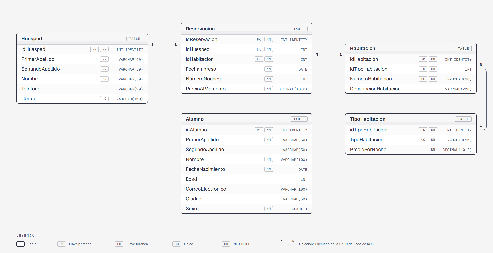

# Paquete de instalación — Sesión 7

Este documento describe el orden de ejecución de los scripts SQL de la sesión 7. Todas las tablas quedan en la base de datos **CursoDB**.

---

## Contexto

La sesión 7 es la introducción a DDL y DML:

- **Ejercicio 1:** la primera tabla del curso, `Alumno`, sin relaciones ni constraints adicionales.
- **Ejercicio 2 — Hotel Vista:** un modelo relacional pequeño con llaves foráneas, `UNIQUE`, `CHECK` y acciones en cascada (`ON DELETE` / `ON UPDATE`).

---

## Modelo Relacional



Versión navegable del diagrama: [`assets/diagrama-er.html`](assets/diagrama-er.html).

Cada tabla tiene su ficha de diccionario de datos:

| Tabla | Ejercicio | Descripción |
|-------|-----------|-------------|
| [`Alumno`](06-Ejercicio-1/docs/tablas/Alumno.md) | Ejercicio 1 | Alumnos del curso; tabla independiente |
| [`TipoHabitacion`](09-Ejercicio-2/docs/tablas/TipoHabitacion.md) | Ejercicio 2 | Catálogo de tipos de habitación con precio por noche |
| [`Habitacion`](09-Ejercicio-2/docs/tablas/Habitacion.md) | Ejercicio 2 | Habitaciones del hotel; cada una es de un `TipoHabitacion` |
| [`Huesped`](09-Ejercicio-2/docs/tablas/Huesped.md) | Ejercicio 2 | Catálogo de huéspedes |
| [`Reservacion`](09-Ejercicio-2/docs/tablas/Reservacion.md) | Ejercicio 2 | Hecho — reservación de un `Huesped` en una `Habitacion` |

---

## Constraints agregados (Ejercicio 2)

- `PRIMARY KEY` con `IDENTITY(1,1)` en todas las tablas.
- `FOREIGN KEY` nombradas (`fk_<Tabla>_<TablaReferenciada>`), con acciones en cascada:
  - `fk_Habitacion_TipoHabitacion`: `ON DELETE CASCADE ON UPDATE CASCADE`.
  - `fk_Reservacion_Huesped`: `ON DELETE CASCADE ON UPDATE CASCADE`.
  - `fk_Reservacion_Habitacion`: `ON DELETE NO ACTION ON UPDATE CASCADE`.
- `UNIQUE` en `Huesped.Correo`, `TipoHabitacion.TipoHabitacion` y `Habitacion.NumeroHabitacion`.
- `CHECK` en `TipoHabitacion.PrecioPorNoche` (`> 0`), `Reservacion.NumeroNoches` (`> 0`) y `Reservacion.PrecioAlMomento` (`> 0`).

---

## Prerequisito

Cada script (excepto el primero, que crea la base de datos) empieza con `USE CursoDB;`, así que se ejecuta sobre CursoDB aunque tengas seleccionada otra base en el dropdown de SSMS.

---

## Instalación

Dos opciones:

- **Rápida:** ejecutar completo (F5) [`06-Ejercicio-1/instalar-completo.sql`](06-Ejercicio-1/instalar-completo.sql) y luego [`09-Ejercicio-2/instalar-completo.sql`](09-Ejercicio-2/instalar-completo.sql). El primero crea CursoDB y la tabla `Alumno`; el segundo, las tablas del Hotel Vista (requiere que CursoDB ya exista).
- **Paso a paso:** ejecutar los scripts en el orden de las tablas de abajo.

Los `instalar-completo.sql` se generan concatenando los scripts de `instalacion/` en orden alfabético (sin los de consultas, `04-consultas.sql` y `07-validar.sql`); si se modifica algún script de `instalacion/`, hay que regenerarlos.

### Paso 1 — Crear la base de datos

Ejecuta este script **una sola vez**. Si CursoDB ya existe, omítelo.

```
06-Ejercicio-1/instalacion/01-create-database.sql
```

---

### Paso 2 — Ejercicio 1: tabla Alumno

| # | Archivo | Descripción |
|---|---------|-------------|
| 1 | `06-Ejercicio-1/instalacion/02-create-table-alumno.sql` | Crea la tabla `Alumno` |
| 2 | `06-Ejercicio-1/instalacion/03-insert-data-alumno.sql` | Inserta 30 alumnos de prueba |
| 3 | `06-Ejercicio-1/instalacion/04-consultas.sql` | Consultas de ejemplo sobre `Alumno` |

---

### Paso 3 — Ejercicio 2: modelo Hotel Vista

| # | Archivo | Descripción |
|---|---------|-------------|
| 1 | `09-Ejercicio-2/instalacion/02-create-tables.sql` | Crea las tablas `TipoHabitacion`, `Habitacion`, `Huesped` y `Reservacion` |
| 2 | `09-Ejercicio-2/instalacion/03-insert-tipohab.sql` | Inserta los tipos de habitación (Sencilla, Doble, Suite) |
| 3 | `09-Ejercicio-2/instalacion/04-insert-habitacion.sql` | Inserta 7 habitaciones con referencia al tipo |
| 4 | `09-Ejercicio-2/instalacion/05-insert-huesped.sql` | Inserta 8 huéspedes ficticios |
| 5 | `09-Ejercicio-2/instalacion/06-insert-reservacion.sql` | Inserta 10 reservaciones con referencia a huésped y habitación |
| 6 | `09-Ejercicio-2/instalacion/07-validar.sql` | Consultas de validación de la estructura y los datos |

> El orden importa por las llaves foráneas: primero tipos, luego habitaciones, luego huéspedes, y al final reservaciones.

---

## Resumen de tablas en CursoDB

| Tabla | Ejercicio | Registros |
|-------|-----------|-----------|
| `Alumno` | Ejercicio 1 | 30 |
| `TipoHabitacion` | Ejercicio 2 | 3 |
| `Habitacion` | Ejercicio 2 | 7 |
| `Huesped` | Ejercicio 2 | 8 |
| `Reservacion` | Ejercicio 2 | 10 |

---

## Reversa

Para deshacer todo lo instalado en esta sesión, ejecuta los siguientes scripts **en el orden indicado**. El orden es el inverso al de la instalación: primero se eliminan las tablas con dependencias, luego las independientes, y al final la base de datos.

### Paso R1 — Reversa Ejercicio 2: tablas Hotel Vista

| # | Archivo | Descripción |
|---|---------|-------------|
| 1 | `09-Ejercicio-2/reversa/01-drop-tables.sql` | Elimina `Reservacion`, `Huesped`, `Habitacion` y `TipoHabitacion` |

### Paso R2 — Reversa Ejercicio 1: tabla Alumno

| # | Archivo | Descripción |
|---|---------|-------------|
| 1 | `06-Ejercicio-1/reversa/01-drop-table.sql` | Elimina la tabla `Alumno` |

### Paso R3 — Eliminar la base de datos

> **Antes de ejecutar este script**, selecciona otra base de datos en el dropdown de SSMS (por ejemplo: `master`). No puedes eliminar una base de datos a la que estás conectado.

| # | Archivo | Descripción |
|---|---------|-------------|
| 1 | `06-Ejercicio-1/reversa/02-drop-database.sql` | Elimina la base de datos `CursoDB` por completo |
