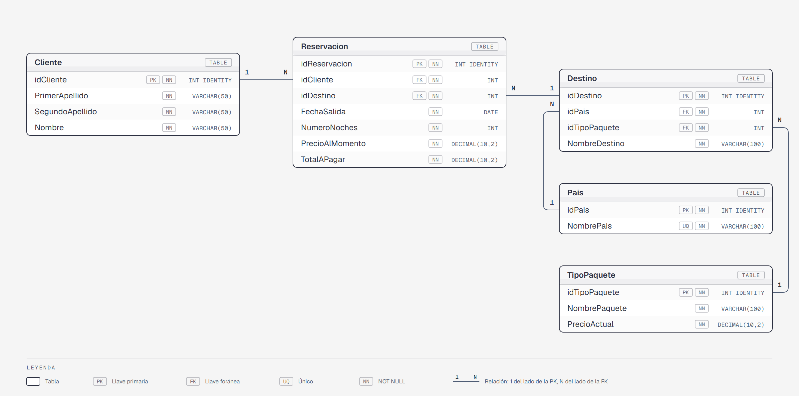

# Paquete de instalación — Sesión 8 · ViajeYA

Este documento describe el orden de ejecución de los scripts SQL de la sesión 8. Todos los scripts corresponden a la solución del **Ejercicio 3 (Evidencia 2): ViajeYA**, una agencia de viajes boutique.

---

## Modelo Relacional



Versión navegable del diagrama: [`assets/diagrama-er.html`](assets/diagrama-er.html).

Cada tabla tiene su ficha de diccionario de datos en [`solucion-evidencia-2-ejercicio-3/docs/tablas`](solucion-evidencia-2-ejercicio-3/docs/tablas): [`Pais`](solucion-evidencia-2-ejercicio-3/docs/tablas/Pais.md) · [`TipoPaquete`](solucion-evidencia-2-ejercicio-3/docs/tablas/TipoPaquete.md) · [`Cliente`](solucion-evidencia-2-ejercicio-3/docs/tablas/Cliente.md) · [`Destino`](solucion-evidencia-2-ejercicio-3/docs/tablas/Destino.md) · [`Reservacion`](solucion-evidencia-2-ejercicio-3/docs/tablas/Reservacion.md).

---

## Constraints agregados

- `PRIMARY KEY` con `IDENTITY(1,1)` en todas las tablas.
- `FOREIGN KEY` nombradas (`fk_<Tabla>_<TablaReferenciada>`), con acciones en cascada: `ON DELETE CASCADE` en `fk_Destino_Pais`, `fk_Destino_TipoPaquete` y `fk_Reservacion_Cliente`; `ON DELETE NO ACTION` en `fk_Reservacion_Destino`; `ON UPDATE CASCADE` en todas.
- `UNIQUE` en `Pais.NombrePais`.
- `CHECK` en `TipoPaquete.PrecioActual`, `Reservacion.NumeroNoches`, `Reservacion.PrecioAlMomento` y `Reservacion.TotalAPagar` (todos `> 0`).

---

## Prerequisito

Cada script (excepto el primero, que crea la base de datos) empieza con `USE ViajeYA;`, así que se ejecuta sobre ViajeYA aunque tengas seleccionada otra base en el dropdown de SSMS.

---

## Instalación

Dos opciones:

- **Rápida:** abrir [`solucion-evidencia-2-ejercicio-3/instalar-completo.sql`](solucion-evidencia-2-ejercicio-3/instalar-completo.sql) en SSMS y ejecutarlo completo (F5). Crea la base de datos, las 5 tablas y los datos iniciales en un solo paso.
- **Paso a paso:** ejecutar los scripts de [`solucion-evidencia-2-ejercicio-3/instalacion`](solucion-evidencia-2-ejercicio-3/instalacion) en el orden de abajo.

`instalar-completo.sql` se genera concatenando los archivos de `instalacion/` en orden alfabético; si se modifica algún script de `instalacion/`, hay que regenerarlo.

### Paso 1 — Crear la base de datos

Ejecuta este script **una sola vez**. Si ViajeYA ya existe, omítelo.

```
solucion-evidencia-2-ejercicio-3/instalacion/01-create-database.sql
```

> Después de ejecutarlo, selecciona **ViajeYA** en el dropdown de SSMS.

---

### Paso 2 — Crear las tablas

| # | Archivo | Descripción |
|---|---------|-------------|
| 1 | `instalacion/02-tablas.sql` | Crea las tablas `Pais`, `TipoPaquete`, `Cliente`, `Destino` y `Reservacion` con sus constraints y llaves foráneas |

---

### Paso 3 — Insertar datos de prueba

| # | Archivo | Descripción |
|---|---------|-------------|
| 1 | `instalacion/03-datos.sql` | Inserta 10 registros en cada tabla respetando el orden de las llaves foráneas |

> El orden de inserción dentro del script es: `Pais` → `TipoPaquete` → `Cliente` → `Destino` → `Reservacion`.

---

## Resumen de tablas en ViajeYA

| Tabla | Descripción |
|-------|-------------|
| `Pais` | Catálogo de países destino |
| `TipoPaquete` | Tipos de paquete con su precio vigente |
| `Cliente` | Datos de los clientes de la agencia |
| `Destino` | Combinación de país y tipo de paquete |
| `Reservacion` | Registro de cada reservación, con precio snapshot y total |

---

## Reversa

Para deshacer todo lo instalado, ejecuta los siguientes scripts **en el orden indicado**.

> Asegúrate de tener seleccionada la base de datos **ViajeYA** en el dropdown de SSMS antes de ejecutar el paso R1.

### Paso R1 — Eliminar las tablas

| # | Archivo | Descripción |
|---|---------|-------------|
| 1 | `reversa/01-drop-tables.sql` | Elimina `Reservacion`, `Destino`, `Cliente`, `TipoPaquete` y `Pais` en orden inverso a las FK |

### Paso R2 — Eliminar la base de datos

> **Antes de ejecutar este script**, selecciona otra base de datos en el dropdown (por ejemplo: `master`). No puedes eliminar una base de datos a la que estás conectado.

| # | Archivo | Descripción |
|---|---------|-------------|
| 1 | `reversa/02-drop-database.sql` | Elimina la base de datos `ViajeYA` por completo |
