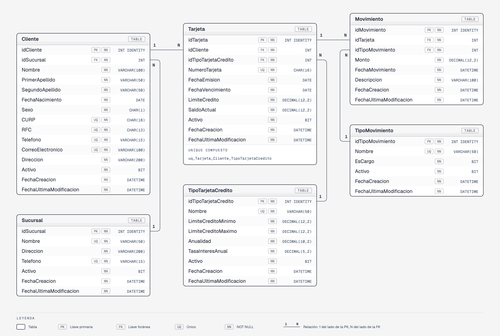

# Examen de Medio Término — SistemaBancarioBD

Base de datos de un sistema bancario sobre la que se resuelve la parte práctica del examen de medio término de Base de Datos II (en línea).

> **Examen:** las instrucciones, los ejercicios de cada alumno y la forma de entrega están en [`entregables/descripcion-examen.md`](entregables/descripcion-examen.md).

> **Estado:** Modelo completo: 6 tablas (`Sucursal`, `Cliente`, `TipoTarjetaCredito`, `Tarjeta`, `TipoMovimiento` y `Movimiento`) con sus datos iniciales, y el procedimiento `usp_registrarMovimiento` ya instalado.

---

## Modelo

Versión navegable del diagrama: [`assets/diagrama-er.html`](assets/diagrama-er.html).

Cada tabla tiene su ficha de diccionario de datos en [`SistemaBancarioBD/docs/tablas`](SistemaBancarioBD/docs/tablas):

| Tabla | Descripción |
|-------|-------------|
| [`Sucursal`](SistemaBancarioBD/docs/tablas/Sucursal.md) | Catálogo de sucursales del banco |
| [`Cliente`](SistemaBancarioBD/docs/tablas/Cliente.md) | Catálogo de clientes del banco (con CURP, RFC y dirección); cada uno pertenece a una `Sucursal` |
| [`TipoTarjetaCredito`](SistemaBancarioBD/docs/tablas/TipoTarjetaCredito.md) | Catálogo de productos de tarjeta de crédito (Básica, Gold, Platinum) con sus parámetros: rango de límite, anualidad y tasa |
| [`Tarjeta`](SistemaBancarioBD/docs/tablas/Tarjeta.md) | Tarjetas de crédito emitidas; relaciona a un `Cliente` con un `TipoTarjetaCredito` |
| [`TipoMovimiento`](SistemaBancarioBD/docs/tablas/TipoMovimiento.md) | Catálogo de tipos de movimiento (Compra, Disposición de efectivo, Anualidad, Pago, Devolución), con `EsCargo` para saber si suben o bajan el saldo |
| [`Movimiento`](SistemaBancarioBD/docs/tablas/Movimiento.md) | Movimientos realizados con cada tarjeta |

---

## Conceptos básicos: saldo, cargo y abono

Una tarjeta de crédito es un préstamo: el banco le presta dinero al cliente hasta cierto límite y el cliente se lo va pagando. Tres conceptos explican cómo se registra eso:

- **Saldo** (`Tarjeta.SaldoActual`): es **lo que el cliente le debe al banco** en este momento.
  - Un saldo **alto** significa que el cliente debe mucho.
  - Un saldo **bajo** significa que debe poco.
  - Un saldo de **`0`** significa que no debe nada (la tarjeta está liquidada).
- **Cargo**: es un movimiento con el que el cliente **usa** el crédito, por ejemplo una compra. Después de un cargo el cliente **le debe más** al banco, así que el saldo **sube**.
- **Abono**: es un movimiento con el que el cliente **le paga** al banco, por ejemplo un pago. Después de un abono el cliente **le debe menos** al banco, así que el saldo **baja**.

| Movimiento | ¿Qué pasa? | ¿Qué le pasa a la deuda? | Saldo |
|------------|------------|--------------------------|-------|
| **Cargo** (compra, disposición de efectivo, anualidad) | El cliente usa el crédito del banco | Le debe **más** al banco | Sube ⬆ |
| **Abono** (pago, devolución) | El cliente le paga al banco | Le debe **menos** al banco | Baja ⬇ |

**Ejemplo.** La tarjeta 1 tiene un límite de 15,000.00 y un saldo de 3,250.00: el cliente debe 3,250.00 y todavía puede gastar 11,750.00 (su **crédito disponible** = `LimiteCredito − SaldoActual`).

| Movimiento | Monto | Saldo después | Crédito disponible |
|------------|-------|---------------|--------------------|
| *(saldo inicial)* | — | 3,250.00 | 11,750.00 |
| Compra (cargo) | 500.00 | 3,750.00 | 11,250.00 |
| Pago (abono) | 750.00 | 3,000.00 | 12,000.00 |

El saldo **nunca** es negativo (el cliente no puede pagar más de lo que debe) ni mayor que el `LimiteCredito` (el cliente no puede gastar más de lo que el banco le presta).

---

## Reglas de negocio

### Sucursales

- Cada cliente se da de alta en **una** sucursal (`Cliente.idSucursal`).
- La dirección (de clientes y sucursales) se guarda completa en un solo campo `Direccion`, sin separar calle, colonia, municipio, etc.
- En los datos iniciales la **Sucursal Guadalupe** no tiene clientes (es de reciente apertura).

### Tarjetas por cliente

- Un cliente puede tener **0, 1, 2 o 3** tarjetas.
- Un cliente **no puede tener dos tarjetas del mismo producto** (`UNIQUE (idCliente, idTipoTarjetaCredito)`); por eso el máximo es 3, una de cada producto.
- El `LimiteCredito` de una tarjeta debe estar dentro del rango `LimiteCreditoMinimo`–`LimiteCreditoMaximo` de su producto. Esto no lo garantiza la tabla (no hay `CHECK` entre tablas): se valida en los procedimientos almacenados.
- El `SaldoActual` (lo que el cliente debe) nunca puede ser negativo ni mayor al `LimiteCredito`.

### Estado de una tarjeta

`Tarjeta` no tiene una columna de estatus: el estado se deduce de `Activo` y `FechaVencimiento`. Cada tarjeta está en **uno y solo uno** de estos tres estados:

| Estado | Condición | Significado |
|--------|-----------|-------------|
| **Vigente** | `Activo = 1 AND FechaVencimiento >= GETDATE()` | La tarjeta se puede usar |
| **Vencida** | `Activo = 1 AND FechaVencimiento < GETDATE()` | No se canceló, pero ya pasó su fecha de vencimiento |
| **Cancelada** | `Activo = 0` | Se dio de baja (sin importar su fecha de vencimiento) |

En los datos iniciales ninguna tarjeta cancelada está vencida, y ninguna tarjeta vigente vence antes de noviembre de 2027, para que el resultado de las consultas no cambie según el día en que se ejecuten.

### Movimientos y saldo

> Si no es claro qué es un cargo, un abono o el saldo, ver primero [Conceptos básicos: saldo, cargo y abono](#conceptos-básicos-saldo-cargo-y-abono).

- Cada movimiento (`Movimiento`) es de un tipo (`TipoMovimiento`). El `Monto` siempre es positivo; si el movimiento **sube** o **baja** el saldo lo decide `EsCargo`:

| Tipo | `EsCargo` | Efecto en `Tarjeta.SaldoActual` |
|------|-----------|--------------------------------|
| Compra, Disposición de efectivo, Anualidad | `1` (cargo) | Suma el `Monto` |
| Pago, Devolución | `0` (abono) | Resta el `Monto` |

- **Los movimientos solo se registran con [`usp_registrarMovimiento`](SistemaBancarioBD/docs/procedimientos/usp_registrarMovimiento.md).** Nunca se debe hacer un `INSERT` directo en `Movimiento`: el SP es el único que también actualiza `Tarjeta.SaldoActual`.
- El saldo de una tarjeta es el resultado de todos sus movimientos: **`SaldoActual` = suma de cargos − suma de abonos**. En los datos iniciales esto se cumple para las 40 tarjetas (las que no tienen movimientos tienen saldo `0`).
- Un cargo no puede dejar el saldo por encima del `LimiteCredito`, y un abono no puede dejarlo negativo (lo valida el SP y, como respaldo, el `CHECK` de `Tarjeta.SaldoActual`).
- Solo se pueden registrar movimientos en tarjetas **vigentes** (lo valida el SP).
- La anualidad solo se cobra en productos con `Anualidad > 0` (Gold y Platinum), por ese monto.

---

## Instalación

Dos opciones:

- **Rápida:** abrir [`SistemaBancarioBD/instalar-completo.sql`](SistemaBancarioBD/instalar-completo.sql) en SSMS y ejecutarlo completo (F5). Crea la base de datos, las tablas y los datos iniciales.
- **Paso a paso:** ejecutar los scripts de [`SistemaBancarioBD/instalacion`](SistemaBancarioBD/instalacion) en este orden:

| Archivo | Descripción |
|---------|-------------|
| `00-create-database.sql` | Crea la base de datos `SistemaBancarioBD` |
| `01-Sucursal/01-create-table.sql` | Tabla `Sucursal` |
| `01-Sucursal/02-insert.sql` | 5 sucursales en el área metropolitana de Monterrey |
| `02-Cliente/01-create-table.sql` | Tabla `Cliente` |
| `02-Cliente/02-insert.sql` | 30 clientes: Centro 10, San Pedro 8, Cumbres 7, Apodaca 5 y Guadalupe 0 |
| `03-TipoTarjetaCredito/01-create-table.sql` | Tabla `TipoTarjetaCredito` |
| `03-TipoTarjetaCredito/02-insert.sql` | 3 productos (Banquito Básica, Gold y Platinum) |
| `04-Tarjeta/01-create-table.sql` | Tabla `Tarjeta` |
| `04-Tarjeta/02-insert.sql` | 40 tarjetas: clientes 1-12 con 1, 13-20 con 2, 21-24 con 3 y 25-30 sin tarjeta; 34 vigentes, 4 vencidas y 2 canceladas |
| `05-TipoMovimiento/01-create-table.sql` | Tabla `TipoMovimiento` |
| `05-TipoMovimiento/02-insert.sql` | 5 tipos de movimiento (3 cargos y 2 abonos) |
| `06-Movimiento/01-create-table.sql` | Tabla `Movimiento` |
| `06-Movimiento/02-insert.sql` | 164 movimientos (2024 a septiembre 2026) en 36 tarjetas; cuadran con el `SaldoActual` de cada tarjeta |
| `06-Movimiento/03-usp-registrar.sql` | SP `usp_registrarMovimiento` — registra un movimiento, valida la tarjeta y el monto, y actualiza `SaldoActual` |

Reversa en [`SistemaBancarioBD/reversa`](SistemaBancarioBD/reversa): elimina el procedimiento, las tablas en orden inverso a las llaves foráneas y luego la base de datos.

### Documentación de los procedimientos

- [`usp_registrarMovimiento`](SistemaBancarioBD/docs/procedimientos/usp_registrarMovimiento.md) — registra un movimiento de tarjeta (cargo o abono) y actualiza su `SaldoActual`; es la única vía permitida para insertar en `Movimiento`

---

> Todos los datos de esta base de datos (nombres, CURP, RFC, direcciones, teléfonos, correos, números de tarjeta, etc.) son ficticios.

## Constraints agregados

- `PRIMARY KEY` con `IDENTITY(1,1)` en todas las tablas.
- `FOREIGN KEY` nombradas (`fk_<Tabla>_<TablaReferenciada>`) en todas las relaciones.
- `UNIQUE` en `Sucursal` (`Nombre`, `Telefono`); `Cliente` (`CURP`, `RFC`, `Telefono`, `CorreoElectronico`); `TipoTarjetaCredito.Nombre`; `TipoMovimiento.Nombre`; `Tarjeta.NumeroTarjeta`; y en el par (`idCliente`, `idTipoTarjetaCredito`) de `Tarjeta`.
- `CHECK` en `Cliente.Sexo` (`IN ('M', 'F')`); en `TipoTarjetaCredito` (límite mínimo positivo, máximo mayor al mínimo, anualidad y tasa no negativas); y en `Tarjeta` (límite positivo, saldo entre `0` y el límite, vencimiento posterior a la emisión); y en `Movimiento.Monto` (`> 0`).
- `DEFAULT 0` en `Tarjeta.SaldoActual`, `DEFAULT 1` en todos los `Activo`, y `DEFAULT GETDATE()` en los campos de auditoría.
