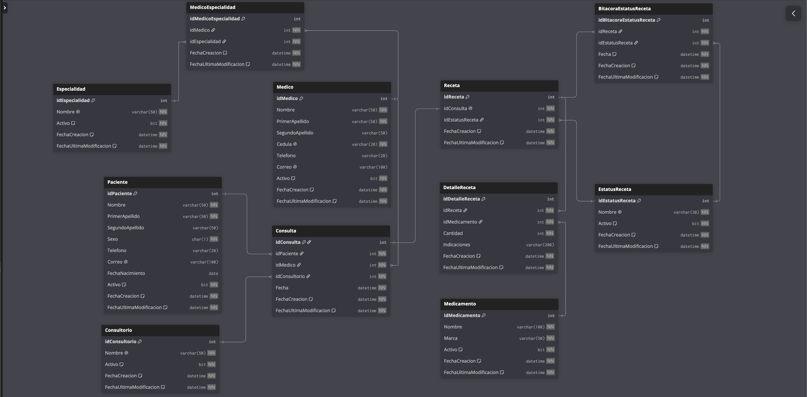

# Sesión 7 — HospitalDB: modelo base para Evidencias 1 y 2

Base de datos nueva para que cada alumno construya sobre el mismo esquema una función + vista (Evidencia 1) y un procedimiento almacenado (Evidencia 2) distintos, de forma que entre los 17 alumnos del grupo se cubra en conjunto una buena parte del CRUD y la lógica de negocio de las tablas.

> **Estado:** tablas, constraints y datos iniciales instalados. Las instrucciones de cada evidencia (qué función/vista/SP le toca a cada alumno) se definen más adelante.

---

## Modelo

11 tablas — cada una con su ficha de diccionario de datos en [`HospitalDB/docs/tablas`](HospitalDB/docs/tablas):

| Tabla | Descripción |
|-------|-------------|
| [`Especialidad`](HospitalDB/docs/tablas/Especialidad.md) | Catálogo de especialidades médicas |
| [`Medico`](HospitalDB/docs/tablas/Medico.md) | Catálogo de médicos |
| [`MedicoEspecialidad`](HospitalDB/docs/tablas/MedicoEspecialidad.md) | Tabla puente — relación **N:M** entre `Medico` y `Especialidad` |
| [`Paciente`](HospitalDB/docs/tablas/Paciente.md) | Catálogo de pacientes |
| [`Consultorio`](HospitalDB/docs/tablas/Consultorio.md) | Catálogo de consultorios (ubicación física) |
| [`EstatusReceta`](HospitalDB/docs/tablas/EstatusReceta.md) | Catálogo de estatus de una receta (Creada, En atención, Surtida, Surtida parcialmente, Cancelada) |
| [`Consulta`](HospitalDB/docs/tablas/Consulta.md) | Hecho — une `Paciente`, `Medico` y `Consultorio` |
| [`Receta`](HospitalDB/docs/tablas/Receta.md) | Hecho — **1:1** con `Consulta`, referencia su estatus actual |
| [`Medicamento`](HospitalDB/docs/tablas/Medicamento.md) | Catálogo de medicamentos |
| [`DetalleReceta`](HospitalDB/docs/tablas/DetalleReceta.md) | Líneas de una receta (medicamento, cantidad, indicaciones) |
| [`BitacoraEstatusReceta`](HospitalDB/docs/tablas/BitacoraEstatusReceta.md) | Historial de transiciones de estatus de una receta |

Todas las tablas llevan `FechaCreacion`/`FechaUltimaModificacion` (auditoría); los catálogos además llevan `Activo BIT` para baja lógica, siguiendo la misma convención que `CompuStoreDB` (sesión 5-6).

### `Receta.idEstatusReceta` vs. `BitacoraEstatusReceta`

No es una relación circular: `EstatusReceta` no referencia de vuelta a `Receta` ni a `BitacoraEstatusReceta`. Es dato redundante intencional — `Receta.idEstatusReceta` guarda el estatus **actual** (lectura rápida, sin `JOIN`+`MAX(Fecha)`), y `BitacoraEstatusReceta` guarda el historial completo. Mismo patrón que `Articulo.PrecioUnitario` + `HistoricoPrecioArticulo` en `CompuStoreDB`. Ver el detalle en [`docs/tablas/Receta.md`](HospitalDB/docs/tablas/Receta.md).

### Reglas de negocio (para Evidencia 2 — validar en el SP correspondiente, pendiente de escribir)

- Una `Consulta` genera **una sola** `Receta` (1:1).
- Una `Receta` puede ganar líneas en `DetalleReceta` mientras su estatus es `1 Creada` o `2 En atención`; en `3`, `4` o `5` debe ser un error. No es obligatorio que una receta en estatus `2` ya tenga líneas (puede estar "en atención" y aún no haberse cargado ningún medicamento). Al agregar la primera línea, si estaba en `1` pasa a `2` (si ya estaba en `2`, se queda en `2`).
- Transiciones de estatus válidas: `1 → 2`, `2 → 3`, `2 → 4`, `4 → 3`, `1 → 5`, `2 → 5`. **No** válidas: `3 → 4` ni cancelar (`→ 5`) desde `3` o `4` — una vez surtida (parcial o completa) ya no se cancela.
- Cada cambio de estatus de una receta debe quedar registrado en `BitacoraEstatusReceta`.

---

## Paquete de instalación

Igual que en `CompuStoreDB` (sesión 5-6), hay dos formas de instalar `HospitalDB`:

1. **Instalación completa en un solo script**: [`HospitalDB/instalar-completo.sql`](HospitalDB/instalar-completo.sql). Ábrelo en SSMS y ejecútalo completo (F5) — crea la base, las 11 tablas y los datos iniciales en un solo paso.
2. **Instalación manual, script por script**: ejecutar cada archivo de [`HospitalDB/instalacion`](HospitalDB/instalacion) en el orden de la tabla de abajo.

`instalar-completo.sql` se genera concatenando los archivos de `instalacion/` en orden alfabético de carpeta y nombre (`find instalacion -name "*.sql" | sort`) — el prefijo numérico de cada carpeta ya respeta las llaves foráneas. Si se modifica algún script de `instalacion/`, hay que regenerar `instalar-completo.sql` (pedir que se regenere).

| Carpeta/Archivo | Contenido |
|-----------------|-----------|
| `00-create-database.sql` | `CREATE DATABASE HospitalDB` |
| `01-Especialidad/01-create-table.sql` | Tabla `Especialidad` |
| `01-Especialidad/02-insert.sql` | 10 especialidades |
| `02-Medico/01-create-table.sql` | Tabla `Medico` |
| `02-Medico/02-insert.sql` | 10 médicos |
| `03-MedicoEspecialidad/01-create-table.sql` | Tabla puente `MedicoEspecialidad` |
| `03-MedicoEspecialidad/02-insert.sql` | 13 relaciones Medico-Especialidad (3 médicos con 2 especialidades, para ilustrar la N:M) |
| `04-Paciente/01-create-table.sql` | Tabla `Paciente` |
| `04-Paciente/02-insert.sql` | 15 pacientes |
| `05-Consultorio/01-create-table.sql` | Tabla `Consultorio` |
| `05-Consultorio/02-insert.sql` | 10 consultorios ("Consultorio 1".."Consultorio 10") |
| `06-EstatusReceta/01-create-table.sql` | Tabla `EstatusReceta` |
| `06-EstatusReceta/02-insert.sql` | 5 estatus (Creada, En atención, Surtida, Surtida parcialmente, Cancelada) |
| `07-Consulta/01-create-table.sql` | Tabla `Consulta` |
| `07-Consulta/02-insert.sql` | 15 consultas (una por paciente) |
| `08-Receta/01-create-table.sql` | Tabla `Receta` |
| `08-Receta/02-insert.sql` | 15 recetas (una por consulta), repartidas entre los 5 estatus |
| `09-Medicamento/01-create-table.sql` | Tabla `Medicamento` |
| `09-Medicamento/02-insert.sql` | 15 medicamentos |
| `10-DetalleReceta/01-create-table.sql` | Tabla `DetalleReceta` |
| `10-DetalleReceta/02-insert.sql` | 16 líneas de detalle (solo en recetas que ya tienen medicamentos asignados) |
| `11-BitacoraEstatusReceta/01-create-table.sql` | Tabla `BitacoraEstatusReceta` |

`BitacoraEstatusReceta` se crea **vacía** a propósito — la irá llenando el SP de cambio de estatus (pendiente de escribir, Evidencia 2).

Reversa en [`HospitalDB/reversa`](HospitalDB/reversa): elimina las tablas en orden inverso a las llaves foráneas y luego la base de datos.

---

## Origen de los datos

- **`Medico`/`Paciente`**: los 25 clientes de `CompuStoreDB` (sesión 5-6) se partieron sin traslape — los primeros 10 se adaptaron a `Medico` (agregando `Cedula`, cambiando el dominio de correo a `@hospitaldb.com`), y los 15 restantes a `Paciente` (agregando `Sexo` y `FechaNacimiento`, que ya traían de origen o se sintetizaron) — para que no exista la misma persona en ambas tablas.
- **`Especialidad`, `Consultorio`, `EstatusReceta`, `Medicamento`, `Consulta`, `Receta`, `DetalleReceta`**: no existía ninguna base de datos previa del curso con este dominio; se crearon desde cero para esta sesión.

## Constraints agregados

- `PRIMARY KEY` con `IDENTITY(1,1)` en todas las tablas.
- `FOREIGN KEY` nombradas (`fk_<Tabla>_<TablaReferenciada>`) en todas las relaciones.
- `UNIQUE` en `Especialidad.Nombre`, `Consultorio.Nombre`, `EstatusReceta.Nombre`; `Medico` (`Cedula`, `Telefono`, `Correo`); `Paciente` (`Telefono`, `Correo`); `Medicamento` (`Nombre`, `Marca`); en el par (`idMedico`, `idEspecialidad`) de `MedicoEspecialidad`, para no duplicar la misma relación; y en `Receta.idConsulta`, para garantizar la relación 1:1 con `Consulta`.
- `CHECK` en `Paciente.Sexo` (`IN ('M', 'F')`) y en `DetalleReceta.Cantidad` (`> 0`).
- `DEFAULT 1` en todos los `Activo`, y `DEFAULT GETDATE()` en los campos de auditoría (y en `BitacoraEstatusReceta.Fecha`).

Todo probado manualmente en la instancia de AWS antes de quedar documentado.
